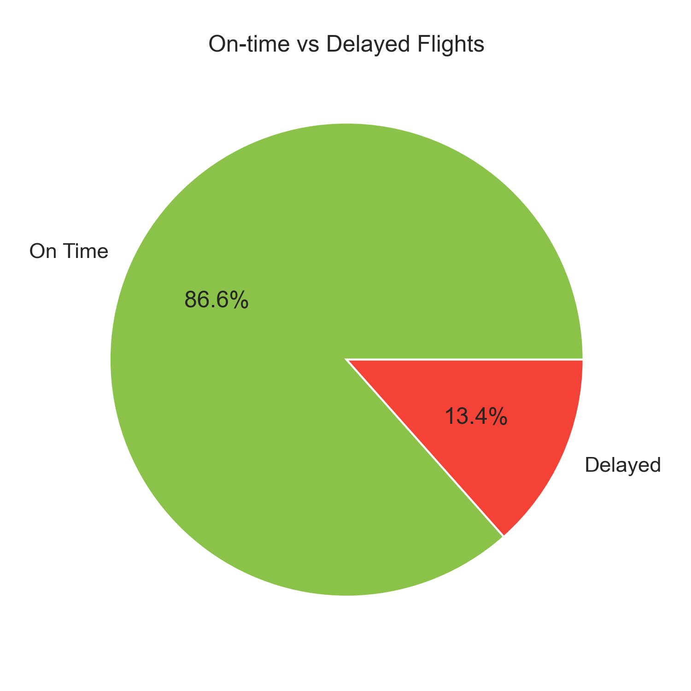
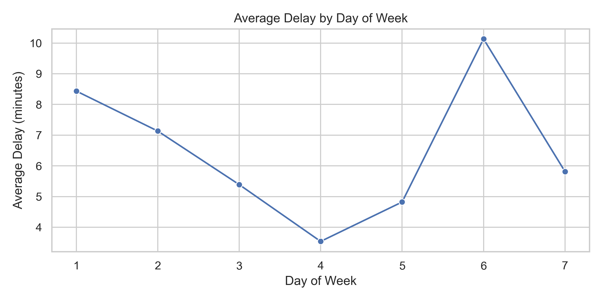
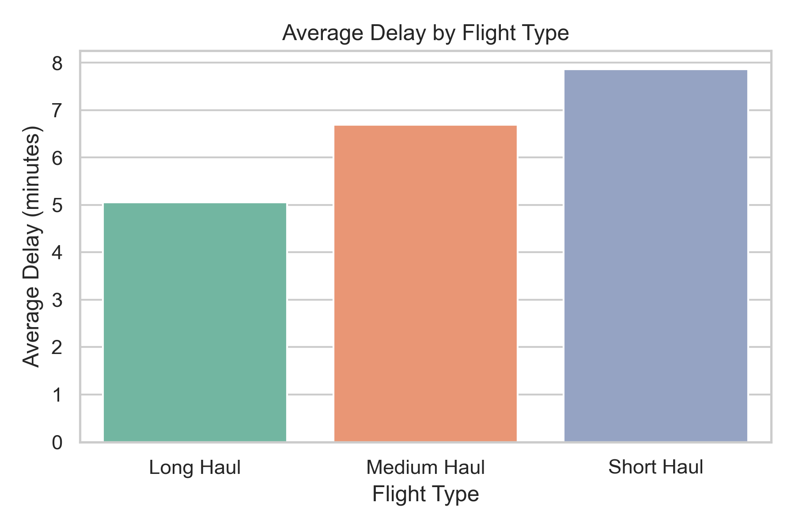
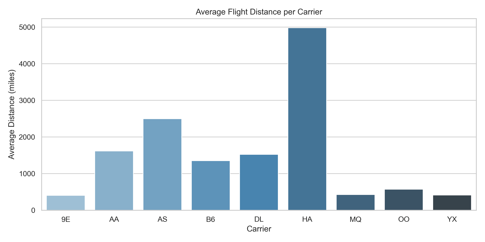
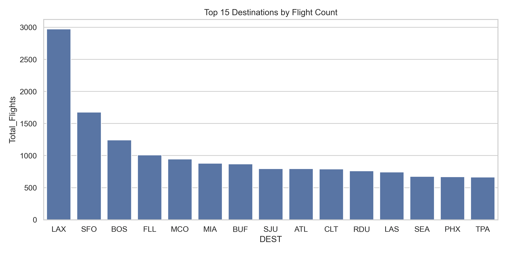
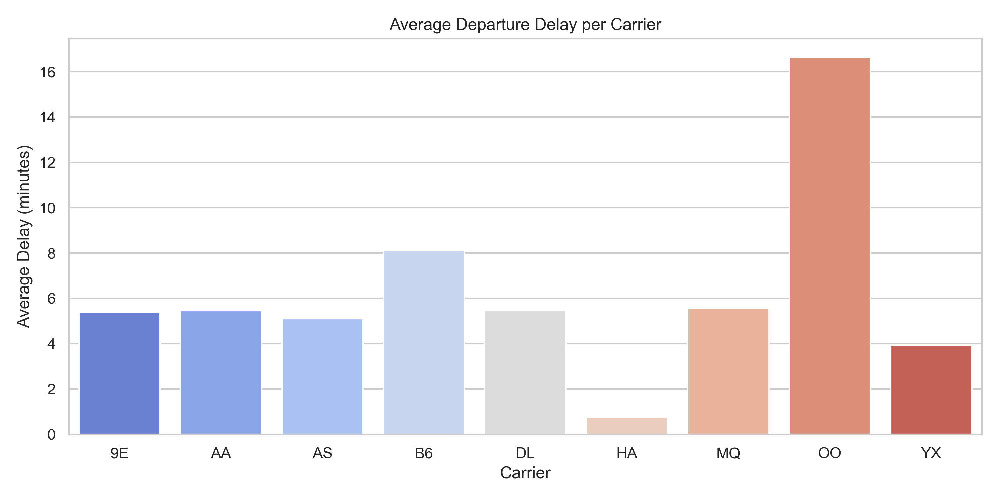

# ✈️ Flight Take-Off Data Analysis – JFK Airport  

[](https://www.linkedin.com/in/mohamed-emad-396981344)  
[](mailto:mohamedemad24649@gmail.com)

---

### 🔍 Project Overview
This project analyzes **flight take-off performance at JFK Airport** using real-world data from [Kaggle](https://www.kaggle.com/datasets/deepankurk/flight-take-off-data-jfk-airport).  
The main objective is to identify **factors influencing flight delays**, evaluate **airline performance**, and assess **weather impact** using **SQL, Python (Pandas, Matplotlib, Seaborn)**, and a **Power BI dashboard (in progress)**.

---

### 📂 Repository Structure
```
├── data/
│ └── flight_data.csv
│
├── sql_queries/
│ └── jfk_analysis_queries.sql
│
├── python_scripts/
│ └── flight_analysis.py
│
├── charts/
│ ├── chart_01_on_time_vs_delayed.png
│ ├── chart_02_avg_delay_by_day.png
│ ├── chart_03_delay_by_flight_type.png
│ ├── chart_04_avg_distance_per_carrier.png
│ ├── chart_05_top_destinations.png
│ ├── chart_06_delay_per_carrier.png
│ └── ... (up to chart_16)
│
├── powerbi/
│ └── JFK_Dashboard.pbix # Power BI dashboard (in progress)
│
└── README.md
```

---

### 🧠 Tools & Technologies
- **Python:** Pandas, Matplotlib, Seaborn, OS  
- **SQL:** Querying, cleaning, and aggregating flight data  
- **Power BI:** Visualization and dashboard design  
- **Dataset:** [Flight Take-Off Data – JFK Airport](https://www.kaggle.com/datasets/deepankurk/flight-take-off-data-jfk-airport)

---

### 📊 Key Visualizations (16 Charts Summary)

#### 🥧 On-time vs Delayed Flights
  
- On Time: **86.6%**  
- Delayed: **13.4%**

#### 📈 Average Delay by Day of Week
  
- Highest on **Day 6 (~10.2 min)**, lowest on **Day 4 (~3.6 min)**

#### ✈️ Average Delay by Flight Type
  
- Short Haul: ~7.8 min  
- Medium Haul: ~6.7 min  
- Long Haul: ~5.0 min  

#### 🧭 Average Flight Distance per Carrier
  
- Longest average distance by **HA (~5000 miles)**  
- Shortest by **9E (~400 miles)**  

#### 🌆 Top 15 Destinations by Flight Count
  
- **LAX:** ~2900 flights  
- **SFO, BOS, FLL, MCO** follow closely.

#### 🕐 Average Departure Delay per Carrier
  
- **OO:** Highest delay (~16.5 min)  
- **HA:** Lowest delay (~0.8 min)

> *(Additional visuals: Wind Speed vs Taxi-Out, Monthly Delay Trends, Weather Conditions, Pressure vs Delay, Humidity Impact, etc.)*  
> See the `/charts/` folder for all **16 visualizations**.

---

### 📈 Insights & Findings

- **🕓 Scheduling Impact:** Early morning and late-night flights experience the highest delays; midday flights are more punctual.  
- **🌦️ Weather Effect:** Fog and light/heavy rain have the strongest correlation with longer departure delays.  
- **✈️ Airline Performance:** Carriers **OO** and **B6** consistently show higher delay averages, while **HA** performs best.  
- **📅 Seasonal Patterns:** Delay averages gradually decline mid-year but surge sharply in **December (~12 min)** — likely due to increased holiday traffic.  
- **💨 Operational Efficiency:** Taxi-out times remain relatively stable regardless of wind speed, suggesting efficient ground operations.  
- **📊 Data Distribution:** Most high-delay days cluster between **17–27 minutes**, indicating occasional systemic bottlenecks.

---

### 🚧 Power BI Dashboard
The Power BI dashboard (currently in development) will include:
- Delay trends by month and carrier  
- Interactive filters for flight type and weather  
- Real-time insights for operational performance

*(📎 Link to be added soon once published.)*

---

### 🧩 Next Steps
- Integrate weather-based predictive modeling  
- Expand data scope to include **arrival delays**  
- Publish and connect the **Power BI dashboard**  

---

### 👨‍💻 Author
**Mohamed Emad | Data Analyst**  

---

### 🏷️ Tags
`#DataAnalysis` `#Python` `#SQL` `#PowerBI` `#DataVisualization` `#AviationAnalytics` `#JFKAirport` `#FlightDelays`

